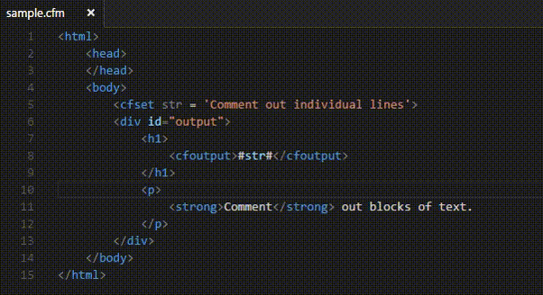
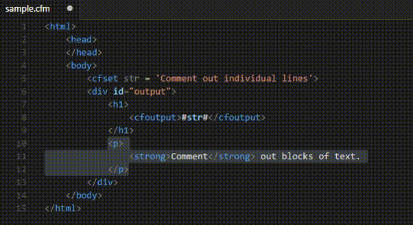

# Coldfusion commentation

## Features

#### Use <kbd>Ctrl</kbd>+<kbd>Shift</kbd>+<kbd>M</kbd> to add/remove comment tags in your Coldfusion files. 

[Download it from the Visual Studio Marketplace](https://marketplace.visualstudio.com/items?itemName=trst.cfml-comment-tags)

___

The [Coldfusion extension by Ilya Verbitskiy](https://marketplace.visualstudio.com/items?itemName=ilich8086.ColdFusion) is required for the extension to work properly.

The following settings trigger the extension.

* The keyboard shortcut
* The language mode  

These can be easily altered in the `packages.json` under `contributes.keybindings`.

_--trst_
